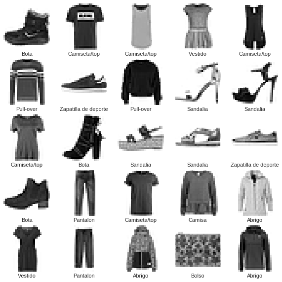
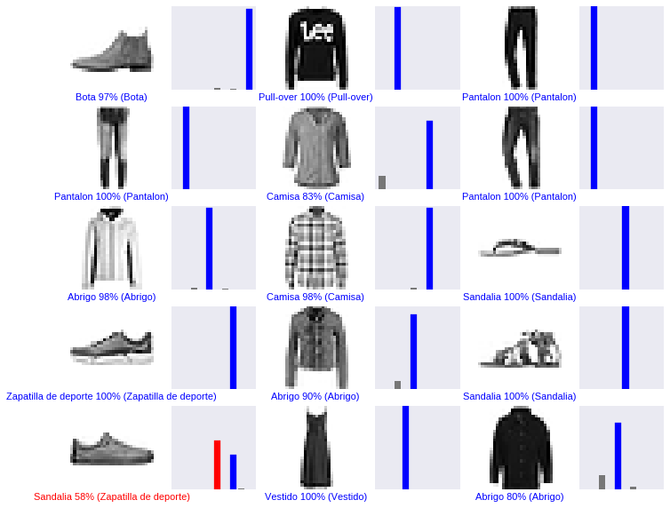

# Clasificador con TensorFlow

Ejemplo para crear y entrenar una red neuronal para clasificar imagenes de ropa por tipo (Zapatillas, Camisa, etc).
[Pruebalo en colab](https://colab.research.google.com/github/SOAI-Valencia/TensorFlow-Ejemplos/blob/master/FashionMNIST.ipynb)

El dataset que usa es [Fasion MNIST](https://github.com/zalandoresearch/fashion-mnist) que contiene 70,000 imagenes en blanco y negro de 10 categorias de tamaño 28x28 pixeles

Fashion MNIST es un sutitudo del clasico [MNIST](http://yann.lecun.com/exdb/mnist/) muy usado para introduccion a Machine learning y contiene imagenes de numeros hechos a mano (0,1,2, etc)

## Categorias

Label | Class
--- | --- 
0 | Camiseta/top
1	| Pantalon
2	| Pull-over
3	| Vestido
4	| Abrigo
5	| Sandalia
6	| Camisa
7	| Zapatilla de deporte
8	| Bolso
9	| Bota

## Archivos
En esta guia se pueden encontrar 3 ejemplos hechos con jupyter notebook:
- [Fashion MNIST Simple](FashionMNISTSimple.ipynb) Modelo basico con un layer. [link colab](https://colab.research.google.com/github/SOAI-Valencia/TensorFlow-Ejemplos/blob/master/Fashion%20MNIST/.ipynb_checkpoints/Fashion%20MNIST%20Simplificado-checkpoint.ipynb)
- [Fashion MNIST](FashionMNIST.ipynb) Ejemplo visto en la charla para el modelo con visualizaciones. [link colab](https://colab.research.google.com/github/SOAI-Valencia/TensorFlow-Ejemplos/blob/master/FashionMNIST.ipynb)
- [Fashion MNIST Keras](FashionMNISTKeras.ipynb) Modelo hecho con TF Keras. [link colab](https://colab.research.google.com/github/SOAI-Valencia/TensorFlow-Ejemplos/blob/master/FashionMNISTKeras.ipynb)

## Resultado de las predicciones

Creditos:
[TF](https://www.tensorflow.org/tutorials/keras/basic_classification)
[Google Colab](https://colab.research.google.com/github/tensorflow/docs/blob/master/site/en/tutorials/keras/basic_classification.ipynb)
